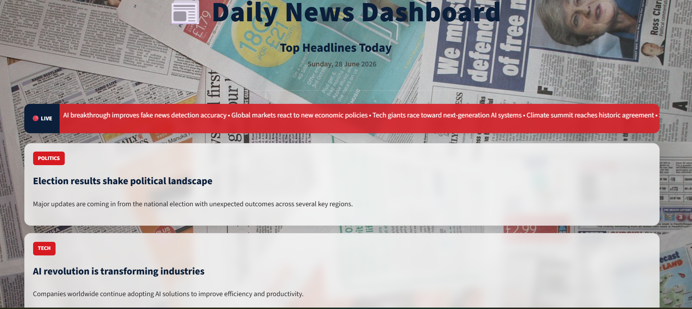

Project Title
# 📰 Fake News Detection using Machine Learning
## 🚀 Live Demo

Coming Soon
## ✨ Features

- 🧠 Fake News Detection
- 📊 Confidence Score
- 🔤 TF-IDF Vectorization
- 🤖 Ensemble Machine Learning
- 🎨 Modern Glassmorphism UI
- 📢 Live Breaking News Ticker
- 📱 Responsive Dashboard

## 🛠 Tech Stack

- Python
- Streamlit
- Scikit-learn
- Pandas
- NumPy
- NLP
- TF-IDF

## Dashboard

git clone https://github.com/YourUsername/Fake-News-Detection.git

cd Fake-News-Detection

pip install -r requirements.txt

streamlit run app.py